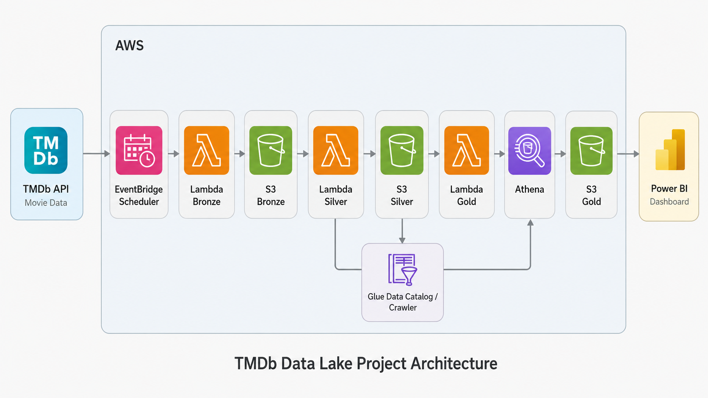
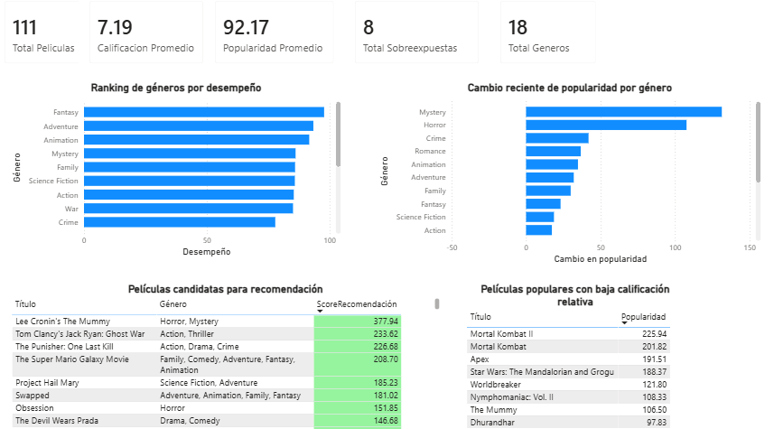

# AWS Serverless Data Pipeline: TMDb Movie Analytics

## Description

**StreamSight TMDb Analytics** is a serverless data engineering project built on AWS to support movie catalog analytics for a streaming platform. The project uses data from the TMDb API to identify recent market behavior, evaluate movie performance, detect overexposed titles, and generate business-ready insights through a Bronze, Silver and Gold data lake architecture.

The pipeline extracts popular movie data from TMDb, stores the raw responses in Amazon S3, transforms and cleans the data into a trusted Parquet format, and finally creates analytical Gold tables using Amazon Athena. The final results are consumed in Power BI through an ODBC connection to Athena.

The goal of the project is to transform raw movie popularity data into useful information for catalog management, content recommendation, promotion decisions and genre trend analysis.

## Business Questions

The project answers four main business questions:

1. **Which genres have the best recent performance?**  
   Helps identify attractive genres that could strengthen the streaming catalog.

2. **Which movies should be recommended or promoted?**  
   Prioritizes titles with a strong combination of popularity, rating and vote volume.

3. **Which movies are popular but have low ratings?**  
   Detects overexposed content that may generate user expectations but low satisfaction.

4. **Which genres are increasing in popularity?**  
   Identifies recent genre trends to support acquisition, recommendation and promotion strategies.

## Data Source

The project uses the TMDb API endpoint:

```text
/movie/popular
```

Each pipeline execution retrieves multiple pages of popular movies and stores the extracted data with ingestion metadata such as source page, ingestion timestamp and ingestion date.

## Data Architecture

The solution follows a Medallion Architecture:

### Bronze Layer

The Bronze layer stores raw data extracted from the TMDb API.

```text
s3://<bucket>/1bronce/tmdb/popular/
```

Data is stored as NDJSON and keeps the original API response with additional ingestion metadata.

### Silver Layer

The Silver layer stores cleaned and structured data in Parquet format.

```text
s3://<bucket>/2silver/movies/
```

Main transformations include:

- Type casting for dates, timestamps and numeric fields.
- Genre ID mapping to readable genre names.
- Removal of invalid or low-quality records.
- Filtering movies with insufficient vote count.
- Creation of an audience score.
- Writing curated data in Parquet format.

### Gold Layer

The Gold layer contains business-ready analytical tables generated with Athena CTAS.

```text
s3://<bucket>/3gold/
```

Gold tables:

```text
gold_performance_genero
gold_ranking_peliculas
gold_peliculas_sobreexpuestas
gold_tendencia_generos
```

These tables are designed to answer the business questions defined for the streaming catalog analysis.

## Architecture Diagram



## Tech Stack

- **AWS Lambda**  
  Serverless processing for Bronze ingestion, Silver transformation and Gold table generation.

- **Amazon S3**  
  Storage for Bronze, Silver and Gold data lake layers.

- **Amazon EventBridge Scheduler**  
  Automated execution of the Bronze ingestion Lambda.

- **AWS Secrets Manager**  
  Secure storage of TMDb API configuration.

- **AWS Glue Data Catalog**  
  Metadata catalog for Silver and Gold tables.

- **AWS Glue Crawler**  
  Schema discovery for the Silver Parquet dataset.

- **Amazon Athena**  
  SQL query engine used to validate data and create Gold analytical tables.

- **Power BI Desktop**  
  Business dashboard connected to Athena through ODBC.

- **Python**  
  Main programming language for Lambda functions and data transformation logic.

- **Pandas / AWS Wrangler / Boto3**  
  Python libraries used for data processing and AWS service integration.

## Main AWS Resources

| Component | Resource |
|---|---|
| S3 Bucket | `unam-2026-ingenieriadatos-equipo1-997622531618-us-east-2-an` |
| Glue Database | `db_movies_tmdb` |
| Silver Table | `2silver` |
| Glue Crawler | `crawler-movies-silver` |
| Bronze Lambda | `tmdb_to_bronze` |
| Silver Lambda | `bronce_tmdb_to_silver` |
| Gold Lambda | `silver_tmdb_to_gold` |

## Lambda Functions

### tmdb_to_bronze

Extracts data from the TMDb API and writes raw NDJSON files to S3 Bronze.

Main responsibilities:

- Read configuration from Secrets Manager.
- Query the TMDb `/movie/popular` endpoint.
- Retrieve multiple pages per execution.
- Add ingestion metadata.
- Store raw data in the Bronze layer.

### bronce_tmdb_to_silver

Transforms raw Bronze data into clean Parquet files in the Silver layer.

Main responsibilities:

- Trigger automatically when a new Bronze file is created.
- Read raw NDJSON files from S3.
- Clean, cast and enrich movie data.
- Map genre IDs to genre names.
- Filter low-quality records.
- Write Parquet files to S3 Silver.
- Invoke the Gold Lambda.

### silver_tmdb_to_gold

Creates the analytical Gold tables using Athena CTAS.

Main responsibilities:

- Drop previous Gold tables.
- Clean previous Gold S3 paths.
- Execute Athena CTAS queries.
- Generate analytical tables for Power BI consumption.

## Security & IAM Roles

The pipeline adheres strictly to the **Principle of Least Privilege (PoLP)**, granting each serverless component only the absolute minimum permissions required for its tasks. The JSON policy definitions are stored under [`src/roles/`](src/roles).

### Principal IAM Roles & Policies
- **Ingestion Role (`tmdb_to_bronze`)**: Allows writing raw JSON files to the Bronze S3 prefix (`1bronce/`) and retrieving TMDb API credentials securely from AWS Secrets Manager.
- **Transformation Role (`bronce_tmdb_to_silver`)**: Allows read access to the Bronze prefix, write access to the Silver prefix (`2silver/`) in Parquet format, and permission to trigger the Gold Lambda asynchronously.
- **Business Aggregation Role (`silver_tmdb_to_gold`)**: Grants full Athena query execution rights, Glue Data Catalog management (creating/dropping tables and database partitions), and S3 read/write access to both Silver and Gold (`3gold/`) layers.
- **Glue/Athena Analytics Role**: Assumed by analytical crawlers to discover schemas and index S3 partitions.
- **Orchestration Scheduler Role**: Grants AWS EventBridge Scheduler permissions to trigger the ingestion Lambda on Mondays and Fridays at 08:00 a.m.

For a comprehensive catalog of all IAM roles and full permission policies, see the dedicated [IAM Security Manual](src/roles/README.md).

## Testing

The project includes a robust, automated test suite consisting of **76 individual test cases** to ensure the pipeline's reliability, configuration integrity, and data quality standards.

The entire test suite is executed **100% locally with zero AWS infrastructure costs** by virtualizing all cloud services:
- **`moto`**: Dynamically mocks virtual S3 buckets and AWS Secrets Manager engines in-memory.
- **`requests-mock`**: Intercepts external TMDb API HTTP calls to serve static JSON payloads.
- **`unittest.mock`**: Intercepts complex analytical steps like Athena CTAS query execution states and asynchronous Lambda-to-Lambda triggers.

### Test Catalog Breakdown
- **Configuration & Security (23 Tests)**: Validates naming schemas, S3 prefixes (`1bronce/`, `2silver/`, `3gold/`), database names, official genre mappings, and data quality thresholds (e.g., minimum 100 votes).
- **Unit Transform Logic (45 Tests)**: Assures exact schema cleanups, date formatting, HSL scoring scales (mapping average vote of 0-10 to an audience score of 0-100), S3 daily partitions, and NDJSON parsing.
- **Integration Flow (8 Tests)**: Simulates real S3 Events, validating that data seamlessly transitions between Bronze, Silver, and Gold layers with full deduplication.

### Execution Guide
1. Install testing dependencies:
   ```bash
   pip install -r tests/requirements-test.txt
   ```
2. Run all tests:
   ```bash
   pytest ./tests -v
   ```
3. Generate detailed test reports and coverage HTML index:
   ```bash
   pytest --cov=src --cov-report=html:tests/coverage_report --cov-report=term > tests/test_report.txt 2>&1
   ```

For a comprehensive breakdown, please refer to the dedicated [Tests Developer Manual](tests/README.md).

## Deployment

The infrastructure can be deployed using the CloudFormation template located in:

```text
iac/cloudformation_tmdb_datalake.yml
```

Suggested deployment command:

```bash
aws cloudformation deploy \
  --template-file iac/cloudformation_tmdb_datalake.yml \
  --stack-name streamsight-tmdb-dev \
  --capabilities CAPABILITY_NAMED_IAM \
  --parameter-overrides \
    TmdbApiKey=YOUR_TMDB_API_KEY \
    DataLakeBucketName=YOUR_UNIQUE_BUCKET_NAME
```

The full replication guide is available in:

```text
deploy/README.md
```

A shorter checklist is available in:

```text
deploy/quickstart_checklist.md
```

## Power BI Dashboard

The Power BI dashboard connects to Athena using the Amazon Athena ODBC driver.

The dashboard includes:

- General movie catalog KPIs.
- Genre performance analysis.
- Recommended movie ranking.
- Overexposed movies table.
- Genre popularity trend analysis.



```text
img/screenshots/powerbi_dashboard.png
```

## Validation and Evidence

Implementation evidence stored under:

```text
img/screenshots/
```

Screenshots:

```text
aws_eventbridge_schedule.png
aws_lambda_functions.png
aws_s3_bronze.png
aws_s3_silver.png
aws_s3_gold.png
aws_glue_catalog_tables.png
aws_athena_gold_queries.png
powerbi_dashboard.png
```

These screenshots demonstrate that the pipeline was implemented in AWS and that the final analytical layer is available for business visualization.

## Things Learned

This project helped reinforce practical experience in:

- Building a serverless data engineering pipeline in AWS.
- Designing a Bronze, Silver and Gold data lake architecture.
- Automating ingestion with EventBridge and S3 events.
- Processing semi-structured API data with Python.
- Storing analytical datasets in Parquet.
- Using Glue Data Catalog and Athena for schema management and SQL analytics.
- Connecting AWS analytical data to Power BI.
- Documenting infrastructure, deployment and business-oriented data products.

## Possible Improvements

### 1. Add orchestration with Step Functions

The current pipeline uses EventBridge, S3 events and Lambda invocation. A future version could use AWS Step Functions to make the orchestration more explicit and easier to monitor.

### 2. Improve data quality validation

Additional validation rules could be added before writing to Silver and Gold, including schema checks, null thresholds and anomaly detection.

### 3. Add CI/CD deployment

The project could be extended with a CI/CD workflow using GitHub Actions to package and deploy Lambda functions automatically.

### 4. Publish Power BI dashboard to Power BI Service

The current dashboard can be refreshed manually in Power BI Desktop. A production version could use Power BI Service and Gateway to configure scheduled refresh after each pipeline execution.

### 5. Expand TMDb data sources

The project currently focuses on popular movies. Future versions could include additional TMDb endpoints such as trending movies, movie details, credits, providers and recommendations.

## Security Considerations

- TMDb API keys are stored in AWS Secrets Manager.
- AWS credentials must not be committed to the repository.
- S3 public access should remain blocked.
- IAM permissions should follow the principle of least privilege.
- Power BI access should use a dedicated IAM user or role with restricted Athena, Glue and S3 permissions.

## License

This project is intended for educational and portfolio purposes. Add a specific license file if the repository will be shared publicly
