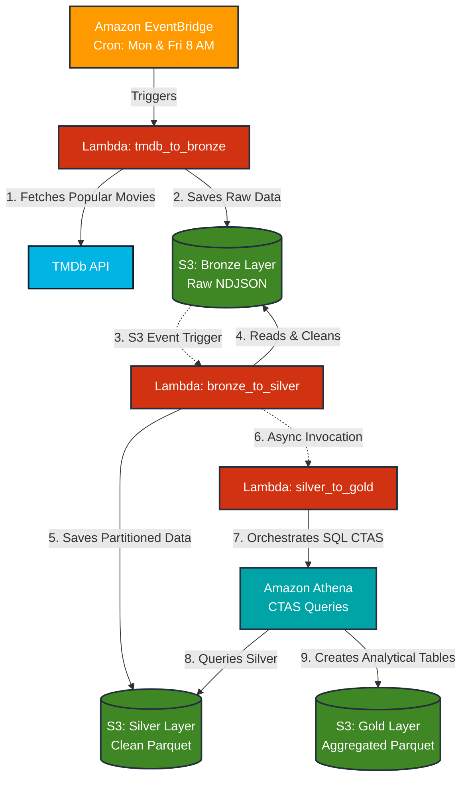

# AWS-TMDb Medallion Architecture

This directory contains the architectural documentation and diagrams for the serverless data pipeline.

## System Architecture Diagram

The following diagram illustrates the event-driven data flow across the Medallion Architecture (Bronze, Silver, Gold).

## Component Breakdown & Architectural Decisions

### 1. Ingestion (Bronze Layer)
- **Amazon EventBridge**: Triggers the ingestion process twice a week automatically. 
  - *Why not cron on EC2/Airflow?* EventBridge is fully managed, serverless, and costs practically zero for this scale, whereas Airflow or an EC2 instance would incur high baseline costs and maintenance overhead for a simple twice-a-week job.
- **tmdb_to_bronze (Lambda)**: Connects to the TMDb API, fetches the first 5 pages of popular movies, and stores the raw responses in Amazon S3. 
  - *Why Lambda?* It scales to zero, meaning we only pay for the few seconds it takes to fetch the data. No servers to manage.
  - *Why NDJSON?* Newline Delimited JSON is ideal for raw streaming data. It allows downstream services to process the file line-by-line without loading the entire JSON array into memory.

### 2. Processing (Silver Layer)
- **S3 Event Notifications**: Automatically triggers the `bronze_to_silver` function the moment a new NDJSON file lands in the Bronze bucket.
  - *Why Event-Driven?* It eliminates the need for a central orchestrator (like Step Functions) polling for changes, reducing latency and complexity.
- **bronze_to_silver (Lambda)**: Reads the raw data, applies basic data quality rules, and saves the refined data back to S3.
  - *Why Parquet format?* Parquet is a highly compressed, columnar format. Unlike CSV or JSON, it allows analytical engines (like Athena) to scan only the required columns, drastically reducing query times and AWS costs.

### 3. Analytics (Gold Layer)
- **Asynchronous Invocation**: Once the Silver layer succeeds, it fires a fire-and-forget event to start the Gold transformation.
- **silver_to_gold (Lambda)**: Orchestrates the creation of business-level tables. It drops the existing Gold tables, cleans the S3 paths, and then uses **Amazon Athena**.
- **Amazon Athena**: Executes CTAS (Create Table As Select) queries using the Presto/Trino SQL engine.
  - *Why Athena CTAS over AWS Glue / EMR?* While Glue/EMR are powerful for Big Data, they have startup times of several minutes and higher minimum costs. Athena is serverless, queries data directly from S3 instantly, and using CTAS to generate aggregations is the most cost-effective way to build a Gold layer for medium-sized datasets.

### Security
- **AWS Secrets Manager** (Not pictured): Securely injects API Keys and bucket configurations directly into the Lambda functions at runtime.
  - *Why not environment variables?* While Lambda env vars are encrypted at rest, Secrets Manager allows centralized rotation, cross-account access if needed, and prevents keys from being exposed in plain text in the AWS Console or infrastructure code.
