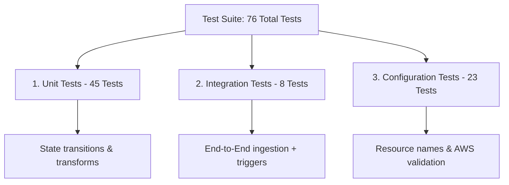

# AWS Movie Data Pipeline - Test Suite Documentation

Welcome to the official developer testing suite for the **AWS Movie Data Pipeline (Medallion Architecture)**. This test suite validates all ingestion, transformation, aggregation, and data quality layers across 76 individual test cases, ensuring extreme robustness, safety against regression, and zero-defect deployments.

---

## Testing Philosophy

Data engineering pipelines are notoriously prone to silent failures (e.g., changes in source schemas, silent duplication, or configuration drift). To prevent this, we implement a **Three-Tier Testing Strategy**:



1. **Unit Tests (45 Tests)**: Verify that functions perform deterministic transformations on dataframes, handle edge cases (empty strings, corrupt inputs), and communicate with mock AWS clients correctly.
2. **Integration Tests (8 Tests)**: Run the Lambdas sequentially using simulated S3 Event structures, verifying that data flows smoothly across the Bronze, Silver, and Gold S3 layers.
3. **Configuration Tests (23 Tests)**: Validate that AWS resource names, API secrets, bucket locations, database schemas, and business mappings (e.g., TMDB official genre mappings) conform strictly to system requirements *before* deployment.

---

## Test Suite Structure

The testing directory is structured as follows:

```text
tests/
├── conftest.py                # Global fixtures, system path injection, and mock AWS env setup
├── requirements-test.txt      # Python dependencies for the test suite
├── test_report.txt            # Captured output of the latest execution (76 passed)
├── coverage_report/           # Visual interactive HTML coverage breakdown (95% coverage)
│   └── index.html
├── configuration/
│   └── test_aws_config.py     # 23 tests validating AWS names, constants & schemas
├── integration/
│   └── test_pipeline_integration.py # 8 tests validating E2E dataflow and triggers
└── unit/
    ├── test_tmdb_to_bronze.py # 8 tests validating TMDb API Ingestion (Bronze Layer)
    ├── test_bronze_to_silver.py # 22 tests validating Spark-like Pandas Transforms (Silver Layer)
    └── test_silver_to_gold.py # 15 tests validating Athena CTAS query steps (Gold Layer)
```

---

## Comprehensive Test Catalog (76 Cases)

### 1. Configuration & Security Validation (23 Tests)

These tests inspect constants, naming constraints, and mappings directly from the source code, eliminating hardcoded bugs.

| Test Case / Group                    | Purpose                               | Validates                                                                                                           |
| :----------------------------------- | :------------------------------------ | :------------------------------------------------------------------------------------------------------------------ |
| **Secrets Manager Config** (3) | Verify connection settings            | Correct regional endpoint (`us-east-2`) and required API keys present in config.                                  |
| **S3 Buckets & Prefixes** (7)  | Prevent writing data to wrong layers  | Strict namespace prefixes for `1bronce/`, `2silver/`, `3gold/`, and correct project bucket names.             |
| **Athena Configuration** (3)   | Validate database configuration       | Correct Glue database name (`db_movies_tmdb`) and dedicated query results S3 location.                            |
| **Genre Mapping Specs** (5)    | Prevent catalog mismatch              | 19 official TMDb genre IDs are statically defined, correct datatypes (Int keys, String names).                      |
| **Lambda Integrations** (2)    | Ensure correct execution paths        | Asynchronous triggers are used with target lambda names matching exactly.                                           |
| **Data Quality Limits** (3)    | Protect downstreams from corrupt data | Minimum rating vote count set to `100`, deduplication set on `id`, null columns mapped on `id` and `title`. |

### 2. Unit Testing Layer (45 Tests)

These verify isolated code blocks. All AWS services are mocked locally using `moto` (in-memory S3/Secrets Manager) or patch utilities.

* #### TMDb Ingestion to Bronze (`test_tmdb_to_bronze.py` - 8 Tests)

  * **Secrets Retrieval**: Validates correct parsing of Secret payloads.
  * **API Interactions**: Employs `requests-mock` to test pagination (pages 1 to 5), rate-limit responses, and network failure fallback.
  * **S3 Writing**: Validates that raw movies are written as modern `NDJSON` (Newline Delimited JSON) files partitioned by daily directory structures (`year=YYYY/month=MM/day=DD/`).
* #### Bronze to Silver Cleaning (`test_bronze_to_silver.py` - 22 Tests)

  * **Data Parsing**: Assures multi-line and trailing-comma NDJSON records are parsed without failing.
  * **Data Quality Rules**: Verifies that movies with `< 100` votes are dropped, rows with null `id`/`title` are filtered out, and entries are deduplicated by `id`.
  * **Transformation Logic**:
    * Extracts arrays of genre IDs and converts them to human-readable strings (e.g., `[28, 12]` $\rightarrow$ `"Action, Adventure"`).
    * Applies standard HSL mathematical scaling to translate `vote_average` from a decimal scale of 0-10 to an audience percentage score of 0-100 (e.g., `7.5` $\rightarrow$ `75`).
    * Coerces corrupted dates safely into `NaT` (Not a Time) using robust mixed parsing formats.
  * **Automation Trigger**: Assures the handler ignores non-bronze S3 events, performs transformations, and successfully triggers the downstream Capa Oro Lambda asynchronously.
* #### Silver to Gold Analytical Aggregation (`test_silver_to_gold.py` - 15 Tests)

  * **Athena State Machine**: Simulates Athena execution states (`QUEUED` $\rightarrow$ `RUNNING` $\rightarrow$ `SUCCEEDED`/`FAILED`/`CANCELLED`), verifying state-polling intervals and retry errors.
  * **State Cleaners**: Validates that target S3 prefixes are fully purged (including high-load batches exceeding 1000 items) to prevent stale/duplicate analytical records.
  * **Schema & CTAS Invocations**: Verifies that 4 tables are created (`top_rated`, `action_adventure`, `by_genre`, `by_release_year`) using highly efficient columnar Parquet formatting on S3.

---

### 3. Integration Testing Layer (8 Tests)

Ensures multiple parts work correctly together. Real S3 events are simulated, and data is fed through a fully functional local pipeline.

* **Bronze to Silver flow**: Verifies data ingest, extraction, cleaning, and formatting in sequence.
* **Genre preservation**: Validates that mapping arrays accurately survive through the Parquet translation.
* **Deduplication survive**: Inserts duplicate rows inside the simulated pipeline run and verifies that the output has exactly one clean entry.
* **Trigger integrity**: Validates S3 events firing Lambda execution, making sure the metadata successfully propagates the correct file location to the following step.
* **CTAS Table references**: Verifies that the gold aggregation scripts point to the right Silver source catalogs.

---

## Local Development & Mocking Strategy

The test suite requires **zero real AWS infrastructure costs** and runs entirely in local memory. This is achieved through a multi-layered simulation and interception architecture:

### 1. The Global Credential Shield (`conftest.py`)

Before any test suite logic is loaded or imports are evaluated, [conftest.py](conftest.py) forces dummy credentials directly into the OS environment variables:

```python
import os
os.environ["AWS_ACCESS_KEY_ID"] = "testing"
os.environ["AWS_SECRET_ACCESS_KEY"] = "testing"
os.environ["AWS_DEFAULT_REGION"] = "us-east-2"
```

This forces `boto3` to initialize safely in testing mode, preventing it from searching for real local IAM profiles or throwing connection region errors.

### 2. In-Memory Infrastructure Mocking (`moto`)

We use `moto` (configured with `@mock_aws`) to simulate complex AWS services entirely in the local system RAM.

* **S3 Simulation**: When our code runs `boto3.client("s3")` and issues actions like `create_bucket`, `put_object`, or `get_object`, `moto` intercepts the HTTP socket connection at the socket-level and routes it to a local dictionary-based mock S3 server. Parquet and JSON files are written and read instantly without touching real S3 networks.
* **Secrets Manager Simulation**: Our ingestion code retrieves TMDb configuration details dynamically from AWS Secrets Manager. During setup, `moto` creates a virtual secret string in local memory, satisfying the `secretsmanager:GetSecretValue` requirements at zero cost.

### 3. API Interception (`requests-mock`)

To test the TMDb API ingestion function (`tmdb_to_bronze.py`) without spamming official TMDb servers or requiring a valid developer API Key:

* `requests-mock` intercepts standard Python HTTP requests at the library level.
* It catches any outgoing call targeting `https://api.themoviedb.org/3/movie/popular` and feeds it a local, mock paginated NDJSON file.
* This allows testing for 200 OK responses, 500 error propagation, and API timeouts in a deterministic environment.

### 4. Code & Service Patching (`unittest.mock.patch`)

Certain complex services like Athena or down-stream Lambdas cannot be fully virtualized in local memory. We bypass this using standard Python `unittest.mock.patch` monkey-patching:

* **Athena State Machine**: Since we cannot run a real local Presto/Athena SQL engine over our S3 virtual files, we mock the `athena` client return payloads. We simulate query executions returning custom query execution IDs and transition the status dictionary from `QUEUED` to `RUNNING` to `SUCCEEDED` dynamically to test our state polling logic.
* **Lambda Asynchronous Invocations**: When `bronce_tmdb_to_silver` finishes processing and invokes `silver_tmdb_to_gold` asynchronously, we patch the `boto3.client("lambda")` instance. Instead of triggering a container, we assert that the `.invoke()` method was called once with target parameters (`FunctionName="silver_tmdb_to_gold"` and `InvocationType="Event"`).

---

## Running the Suite

Execute all tests:

```bash
pytest ./tests -v
```

Generate the terminal code coverage report and update the visual HTML dashboard:

```bash
pytest --cov=src --cov-report=html:tests/coverage_report --cov-report=term > tests/test_report.txt 2>&1
```

